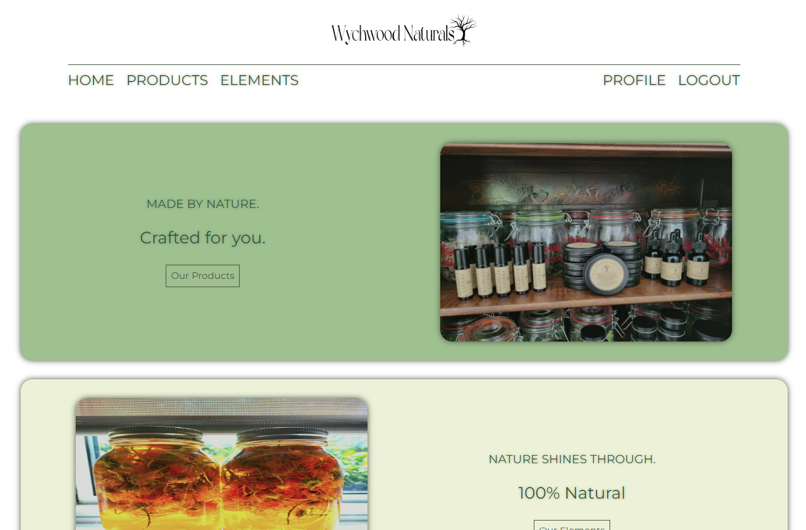

# Wychwood Naturals

In this capstone, I wanted to partner with a local small business to help create a draft for a future website.



## Overview

Wychwood Naturals is a small family business that focuses on the benefits of natural and locally-sourced ingredients. All products are hand-crafted with the intent of providing alterative options for individuals who appreciate products made from homegrown herbs and hand-picked botanicals.

### Front End

- React
- react-router
- SASS
- Javascript
- Axios

### Back End

- MySQL2
- Express
- JWT (jsonwebtoken)
- BCrypt
- Knex
- Node

### Installation

1. Install dependencies

```
npm i
```

2. Configure .env.sample based on placeholder (also rename to .env).

```
REACT_APP_API_URL = <http://localhost:PORT>
```

3. Build and run server

```
npm start
```
