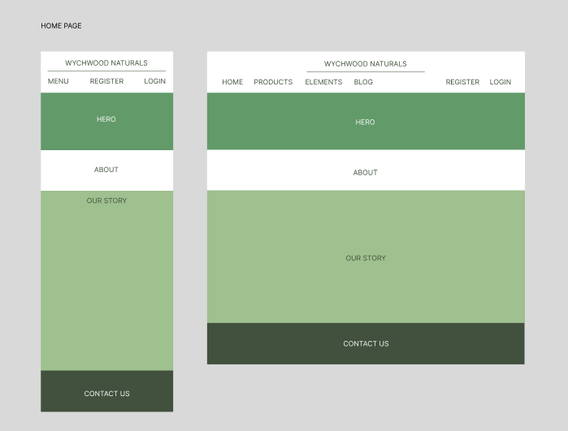
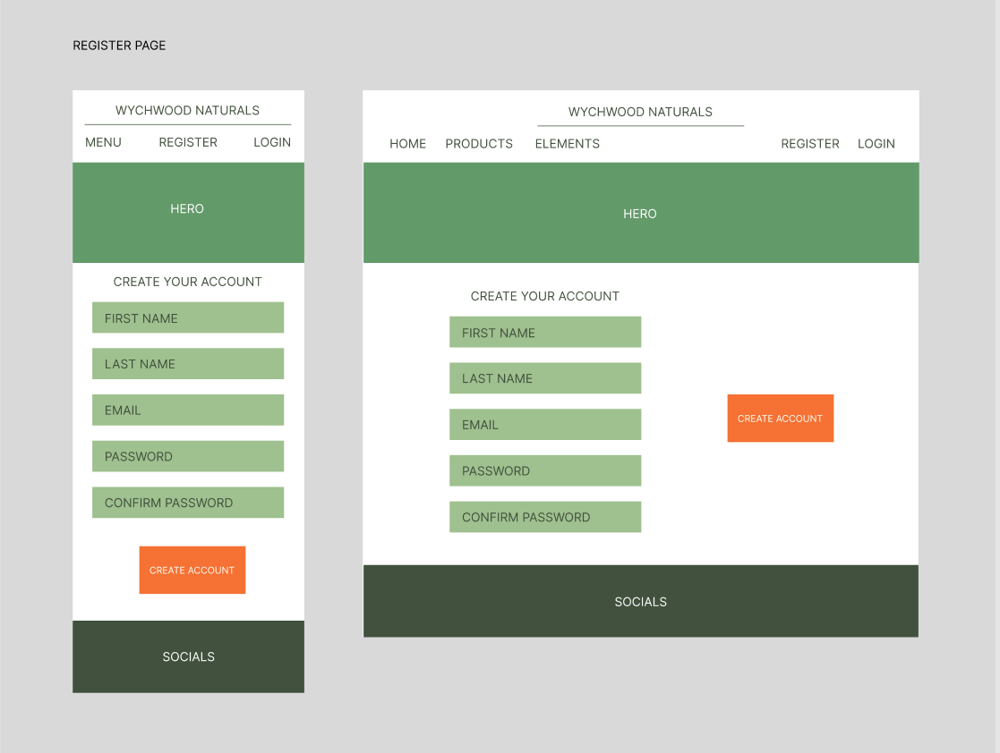
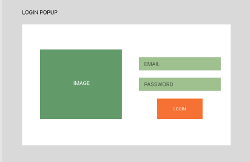
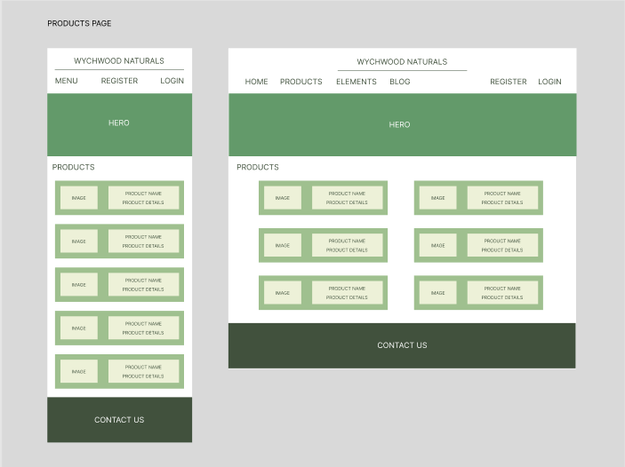
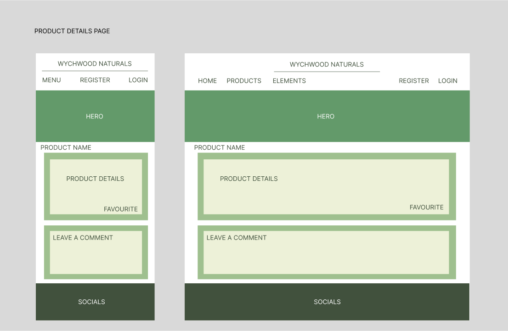
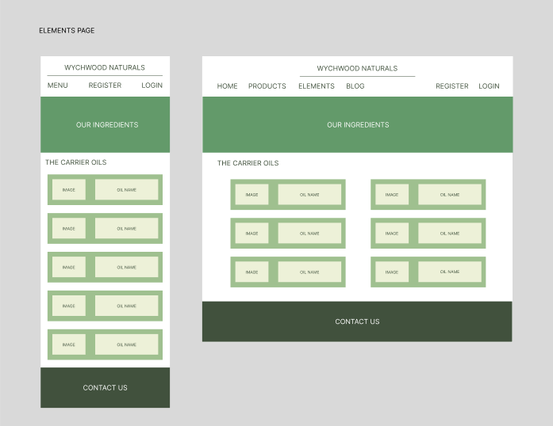
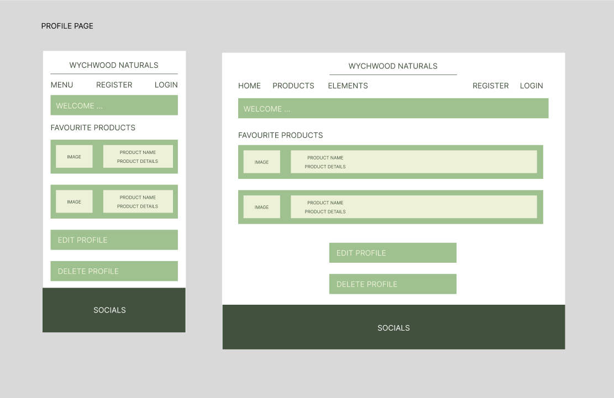
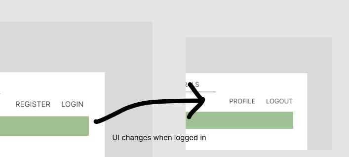
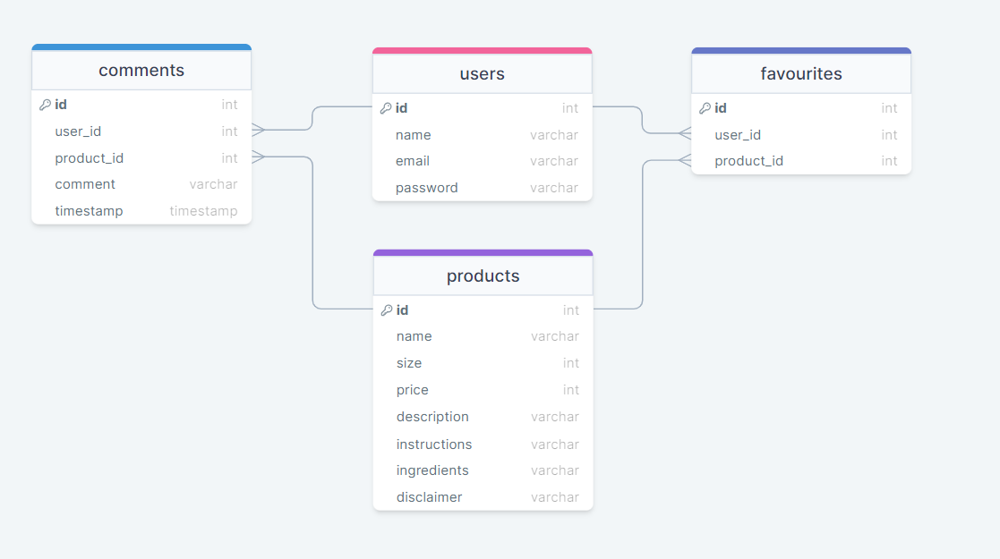

# Project Title

Wychwood Naturals

## Overview

<!-- What is your app? Brief description in a couple of sentences. -->

Wychwood Naturals is a small family business that focuses on the benefits of natural and locally-sourced ingredients. All products are hand-crafted with the intent of providing alterative options for individuals who appreciate products made from homegrown herbs and hand-picked botanicals.

### Problem

<!-- Why is your app needed? Background information around any pain points or other reasons. -->

The idea of Wychwood Naturals came from necessity and curiousity. Necessity because sometimes store-bought products contain unfavourable ingredients for those with sensitive skin and curiousity to see if there are better options from natural resources. With Wychwood Naturals being a small family-owned business, I wanted to improve on the webpage layout as well as create a more dyanmic products products that could easily be updated when new products are available. Also, with the intent of one day having an online store front, I wanted to create the ability to make a user profile and connect it with a shopping cart.

### User Profile

<!-- Who will use your app? How will they use it? Any special considerations that your app must take into account. -->

- Anyone:
  - Looking for natural alternatives to store-bought products
  - Looking to discover the benefits of alot of easily accessible herbs and botancials
  - Looking to create a profile and purchase products

### Features

<!-- List the functionality that your app will include. These can be written as user stories or descriptions with related details. Do not describe _how_ these features are implemented, only _what_ needs to be implemented. -->

- As a user, I want to be able to learn about the company, it's story, and where it's located
- As a user, I want to be able to discover the products and learn about the ingredients

- As a user, I want to be able to create an account 
- As a user, I want to be able to login to my account in order to add and remove products from my favourites list

- As a logged in user, I want to be able to add products to a favourite list
- As a logged in user, I want to be able to add a comment on the product details page
- As a logged in user, I want to view my profile page to see my favourite list
- As a logged in user, I want to be able to update my account information
- As a logged in user, I want to be able to delete my account

## Implementation

### Tech Stack

<!-- List technologies that will be used in your app, including any libraries to save time or provide more functionality. Be sure to research any potential limitations. -->

- React
- Javascript
- MySQL
- Express

Client Libraries:

- react
- react-router
- axios

Server Libraries:

- knex
- express

### APIs

<!-- List any external sources of data that will be used in your app. -->

### Sitemap

<!-- List the pages of your app with brief descriptions. You can show this visually, or write it out. -->

- Home Page
- Products
- Product Details Page
- Elements
- Register
- Login
- Profile


### Mockups

<!-- Provide visuals of your app's screens. You can use tools like Figma or pictures of hand-drawn sketches. -->

#### Home Page



#### Register Page



#### Login Popup



#### Products Page



#### Product Details Page



#### Elements Page



#### Profile Page



#### UI Changes



### Data

<!-- Describe your data and the relationships between them. You can show this visually using diagrams, or write it out. -->



### Endpoints

<!-- List endpoints that your server will implement, including HTTP methods, parameters, and example responses. -->

**GET /products**

- Get products

Parameters:

Response:
```
[
  {
    "productId": 1,
    "name": "Muscle Salve",
    "size": 30,
    "price": 11,
  }
]
```

**GET /products/:id**

- Get product by Id

Parameters:

- productId: Product id

Response:
```
[
  {
    "productId": 1,
    "name": "Cayenne & Ginger Muscle Salve",
    "size": 30,
    "price": 11,
    "description": "This is the one you need for sore muscles and joints. The oil blend has been double-infused with both select botanicals and loads of spices. The spices and essential oils have been chosen for their ability to boost circulation, relieve pain, and reduce inflammation. It has a light scent and feels great when massaged into sore muscles.",
    "instructions": "TO USE: Rub a small amount onto affected areas twice daily. For best results use for at least two consecutive weeks.",
    "ingredients": "INGREDIENTS: Olive, Sweet Almond, Jojoba, and Vitamin E oils, Cacao butter, beeswax, EO: ginger, black pepper, lavender, eucalyptus, cayenne, ginger, turmeric, black pepper, dandelion, peppermint, CONTAINS TREE NUT OILS",
    "disclaimer": "CAUTION: Contains tree nut oils. Always do a patch test and discontinue use if irritation occurs. Not for use on young children or if pregnant/nursing. External use only on unbroken skin. Avoid eyes, mouth, and sensitive areas.",
  }
]
```

**GET /products/:id/comments**
- Retrieves comments associated with a specific product

Parameters:

- commentId: Comment id

Response:
```
[
  {
    "commentId": 1,
    "name": "Jane Doe"
    "comment": "What a great product!"
    "timestamp": 1530744795832,

  }
]

```

**POST /products/:id/comments**
- Adds a new comment to the specific product

Parameters:

- userId: User id
- name: User name associated with logged in user
- comment: User's comment

Response:
```
[
  {
    "commentId": 1,
    "message": "Comment added successfully"
  }
]

```


**POST /products/:id/favourite**

- Favourite a product

Response:
```
[
  {
    "message": "Product favourited",
    "favourited": true,
  }
]
```

**GET /users/:id/favourites**
- Get list of favourited products by user

Response:
```
[
   {
    "productId": 1,
    "name": "Muscle Salve",
    "size": 30,
    "price": 11
  },
]
```

**GET /elements**

- Get elements

Parameters:

Response:
```
[
  {
    "elementId": 1,
    "name": "Grapeseed Oil",
    "description": "Made from seeds of Vitis vinifera, this light oil absorbs quickly to moisturise without clogging pores. It also boosts circulation which can reduce the appearance of blemishes, wrinkles, sun damage, stretch marks, cellulite and varicose veins. Soothes eczema"
  }
]
```

**POST /user/register**

- Add a user account

Parameters:

- name: user's first and last name
- email: user's email
- password: user's provided password
- confirm_password: user's provided password again to match password

Response:
```
{
  "token": ""
}
```

**POST /user/login**

- Login a user

Parameters:

- email: user's email
- password: user's provided password

Response:
```
{
  "token": ""
}
```

**PUT /user/:id**
- Update account information

Parameters:
- name: user's first and last name
- email: user's email
- password: user's provided password
- confirm_password: user's provided password again to match password

Response:
```
{
  "message": "Account updated successfully"
}
```

**DELETE /user/:id**
- Delete user account

Response:
```
{
  "message": "Account deleted successfully"
}
```


### Auth

<!-- Does your project include any login or user profile functionality? If so, describe how authentication/authorization will be implemented. -->

- JWT auth
    - Before adding auth, all API requests will be using a fake user with id 1
    - Added after core features have first been implemented
    - Store JWT in localStorage, remove when a user logs out
    - Add states for logged in showing different UI in places listed in mockups

## Roadmap

<!-- Scope your project as a sprint. Break down the tasks that will need to be completed and map out timeframes for implementation. Think about what you can reasonably complete before the due date. The more detail you provide, the easier it will be to build. -->

- Create client

- Create server

- Create migrations

- Create seeds

- Feature: Home Page
    - Implement Home page

- Feature: Products Page
    - Implement Products page
    - Create GET /products endpoint

- Feature: Product Details Page
    - Implement Product Details page
    - Create GET /products/:id endpoint
    - Create GET /products/:id/comments endpoint
    - Create POST /products/:id/comments endpoint
    - Create POST /products/:id/favourite endpoint

- Feature: Elements Page
    - Implement Elements page
    - Create GET /elements endpoint

- Feature: Create Account
    - Implement Register Page and form
    - Create POST /user/register endpoint

- Feature: Login 
    - Implement Login Popup and form
    - Create POST /user/login endpoint

- Feature: Profile
    - Implement Profile Page
    - Create GET /users/:id/favourite endpoint
    - Create PUT /user/:id endpoint
    - Create DELETE /user/:id endpoint

- Feature: Implement JWT tokens
    - Server: Update expected requests / responses on protected endpoints
    - Client: Store JWT in local storage, include JWT on axios calls

- Bug fixes

- DEMO DAY

## Nice-to-haves

<!-- Your project will be marked based on what you committed to in the above document. Under nice-to-haves, you can list any additional features you may complete if you have extra time, or after finishing. -->

- Add 'Leave a Review' to Contact Page
- Allow users to favourite products
- Add checkout functionality
- Add Blog page
- Add Profile Page
